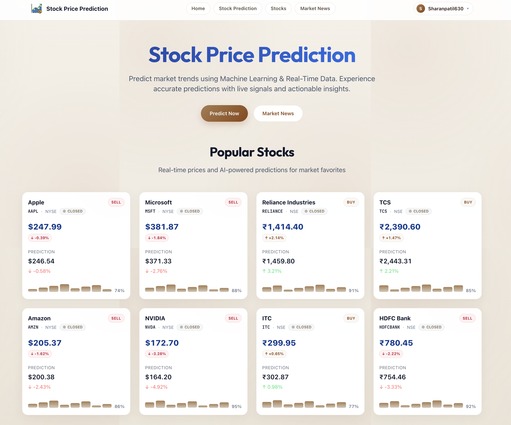
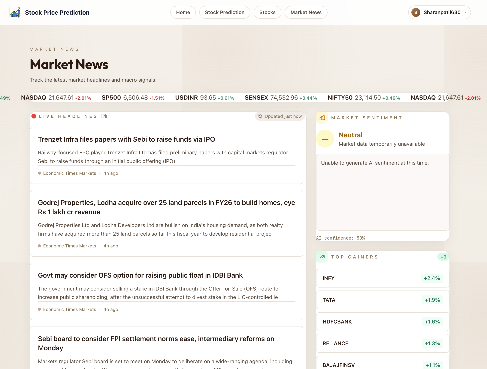

## Stock Price Prediction Platform

<div align="center">

**End‑to‑end ML-powered stock prediction dashboard**

[](https://www.docker.com/)
[](https://fastapi.tiangolo.com/)
[](https://nextjs.org/)
[](#)
[](https://opensource.org/licenses/MIT)
[](https://www.python.org/downloads/)
[](https://nodejs.org/)

</div>

---

### Overview

- **Backend**: FastAPI with ML models (e.g. LSTM) exposed via typed REST APIs
- **Frontend**: Next.js/React trading-style dashboard for charts, predictions, and market views
- **Infrastructure**: Docker + `docker-compose`, Nginx gateway, and Makefile helpers for a smooth DX

This repository is designed as a **professional, production‑ready template** for time‑series / stock‑prediction projects, with clear separation between backend, frontend, and infrastructure.

---

### Tech Stack At A Glance

| Layer          | Technologies                                |
| ------------- | ------------------------------------------- |
| **Frontend**  | Next.js, React, TypeScript, modern UI/UX   |
| **Backend**   | FastAPI, Python, ML (e.g. LSTM)             |
| **Data**      | Finnhub, Alpha Vantage, local JSON fallback |
| **Infra/Tooling** | Native services, PostgreSQL, MongoDB (Redis optional) |

---

### Features

- **Machine Learning powered predictions**
  - LSTM-based model for stock price forecasting
  - Inference service exposed via REST API
- **Data integrations**
  - Finnhub and Alpha Vantage market data support
  - Simple local JSON data for demo/testing
- **Full-stack app**
  - API server (FastAPI) with typed routes and OpenAPI docs
  - Next.js UI for viewing prices, predictions, and portfolio
- **Native development setup**
  - Simple scripts to start all services
  - Next.js proxy handles API routing without Nginx

---

### Architecture

```
┌─────────────────┐    ┌──────────────────┐    ┌─────────────────┐    ┌─────────────────┐
│   Frontend      │    │    Backend       │    │   ML Models     │    │  Data Sources   │
│   (Next.js)     │◄──►│   (FastAPI)      │◄──►│   (LSTM, etc.)  │◄──►│  (Finnhub, AV)  │
│                 │    │                  │    │                 │    │                 │
│ • UI Components │    │ • REST APIs      │    │ • Prediction    │    │ • Market Data   │
│ • Charts        │    │ • Data Processing│    │ • Training      │    │ • Historical    │
│ • Real-time     │    │ • Validation     │    │ • Inference     │    │ • News Feed     │
└─────────────────┘    └──────────────────┘    └─────────────────┘    └─────────────────┘
```

**Data Flow:**
1. **Frontend** requests data from FastAPI backend
2. **Backend** fetches market data from external APIs (Finnhub, Alpha Vantage)
3. **ML Models** process historical data to generate predictions
4. **Results** are cached and served back to frontend via REST APIs
5. **Real-time updates** through periodic polling and WebSocket connections

---

### Screenshots

<div align="center">

**Landing & How It Works**



**Stock Search & Popular Stocks**


**Prediction Detail & Strategy**


**Market News & Sentiment**



</div>

---

### Project Structure

```text
.
├── backend/           # FastAPI app, ML models, services
├── frontend/          # Next.js web UI
├── data/              # Sample/local data (non-sensitive)
├── start.sh           # Start all services
├── stop.sh            # Stop all services
└── README.md
```

---

### Prerequisites

- **Python 3.11+** and **Node.js 18+**
- **PostgreSQL** and **MongoDB** (Redis optional - has in-memory fallback)
- **API keys**:
  - Finnhub API key
  - Alpha Vantage API key

---

### Quick Start (No Docker)

Prerequisites: Python 3.11+, Node.js 18+, PostgreSQL, MongoDB (Redis optional)

1. **Clone the repo**

```bash
git clone https://github.com/Sharan0555/StockPricePrediction.git
cd StockPricePrediction
```

2. **Copy .env.example to .env and fill in API keys**

```bash
cp .env.example .env
# Edit .env and add your FINNHUB_API_KEY and ALPHAVANTAGE_API_KEY
```

3. **Run database setup**

```bash
bash backend/setup_db.sh
```

4. **Start everything**

```bash
bash start.sh
```

5. **Open http://localhost:3000**

**Stop everything**: `bash stop.sh`

---

## Free Deployment

### Backend → Render (free)
1. Go to render.com and sign up with GitHub
2. Click New → Blueprint → select this repo
3. Add env vars: `FINNHUB_API_KEY`, `ALPHAVANTAGE_API_KEY`, and `FRONTEND_URL`
4. Deploy — Render will assign a URL such as `https://<your-render-service>.onrender.com`

### Frontend → Vercel (free)
1. Go to vercel.com and sign up with GitHub
2. Click New Project → import this repo
3. Set root directory to: frontend
4. Add env var: `NEXT_PUBLIC_API_URL=https://<your-render-service>.onrender.com`
5. Deploy — Vercel will assign a URL such as `https://<your-project>.vercel.app`
6. Update Render `FRONTEND_URL` to your deployed Vercel URL so backend CORS allows the frontend

---

### Known Limitations

⚠️ **Educational Purpose Only**
- **Not Financial Advice**: All predictions are for educational and demonstration purposes only
- **Market Risks**: Real stock markets involve complex factors not captured by this model
- **Historical Data**: Predictions based solely on historical price patterns may not reflect future performance
- **No Guarantee**: Past performance does not guarantee future results

**Technical Limitations:**
- Model accuracy depends on quality and quantity of training data
- Real-time market data may have delays or API rate limits
- Predictions are generated using simplified LSTM models
- No consideration of fundamental analysis, news sentiment, or economic indicators

---

### Services & URLs

Once the stack is running:

- **Frontend**: http://localhost:3000
- **Backend API**: http://localhost:8001
- **API Docs**: http://localhost:8001/api/docs
- **Example endpoint**: http://localhost:8001/api/v1/stocks/fx/inr?base=USD

---

### Local Development (Manual)

If you prefer to run services individually:

- **Backend**:

```bash
cd backend
python -m venv .venv
source .venv/bin/activate
pip install -r requirements.txt
uvicorn app.main:app --host 0.0.0.0 --port 8001 --reload
```

- **Frontend**:

```bash
cd frontend
npm install
npm run dev
```

---

### Tests

Backend tests (example with `pytest`):

```bash
cd backend
pytest
```

---

### Roadmap

**Planned Features:**
- 🔄 **Real-time WebSocket Updates** - Live price streaming without polling
- 👤 **User Authentication** - Portfolio tracking and personalized predictions
- 📊 **Advanced Charting** - Technical indicators and drawing tools
- 🤖 **Enhanced ML Models** - Ensemble methods and sentiment analysis
- 📱 **Mobile App** - React Native companion application
- 🌐 **Multi-market Support** - International exchanges and currency pairs
- 🔔 **Price Alerts** - Custom notifications for price movements
- 📈 **Backtesting Engine** - Historical strategy testing
- 🏦 **Broker Integration** - Real trading API connections
- 📰 **News Sentiment Analysis** - NLP-based market sentiment scoring

**Community Contributions Welcome!**

---

### Contributing

Contributions, issues, and feature requests are welcome!

1. Fork the repo
2. Create a feature branch: `git checkout -b feature/my-feature`
3. Commit your changes: `git commit -m "feat: add my feature"`
4. Push the branch: `git push origin feature/my-feature`
5. Open a Pull Request on GitHub

---

### License

This project is licensed under the MIT License.
